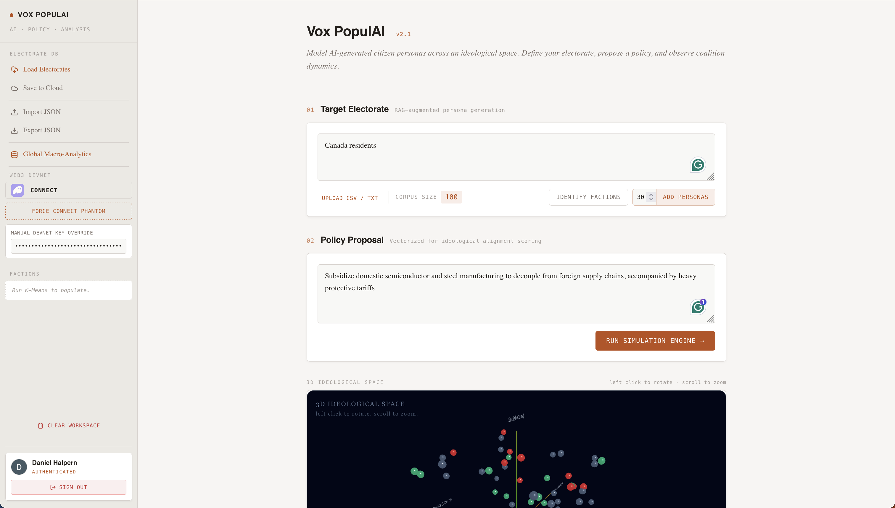
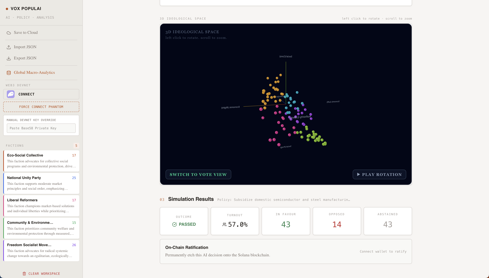
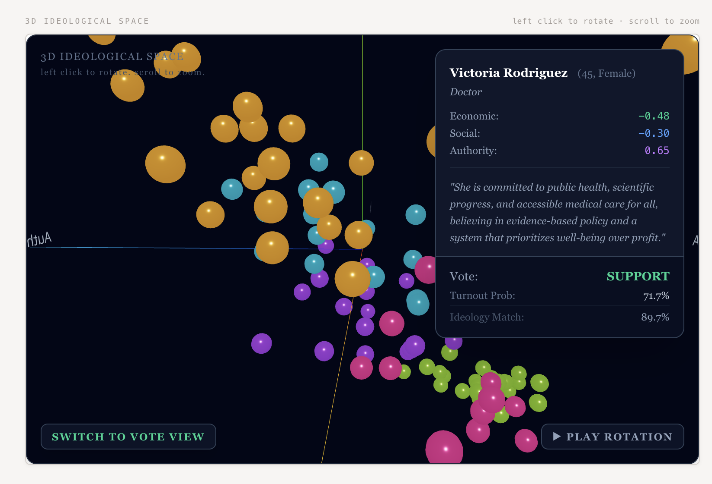
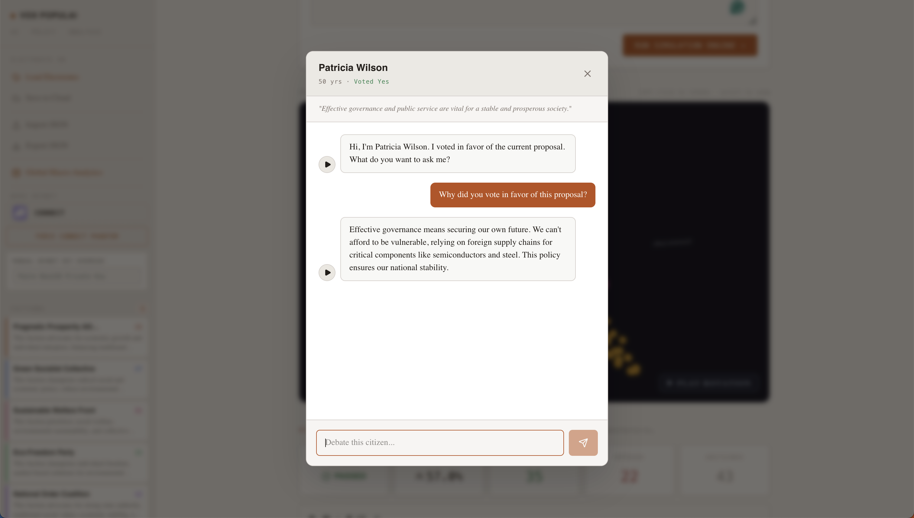
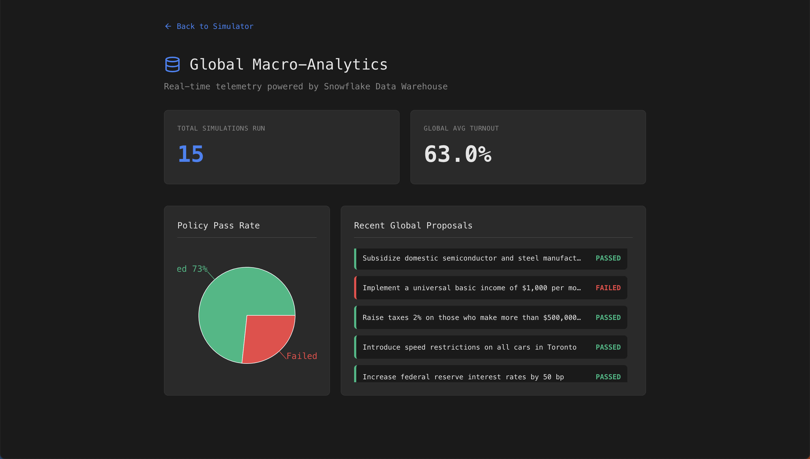
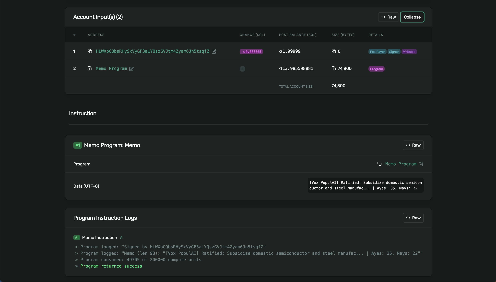

# Vox PopulAI

**A 6-dimensional AI electorate simulation engine that predicts voter behavior.**

<!-- Replace YOUR_VIDEO_ID with your actual YouTube video ID -->
<!-- [](https://youtu.be/YOUR_VIDEO_ID) -->
<!-- *< click image to watch our demo video!* -->

---

## Inspiration
In today's hyper-polarized political climate, it's incredibly difficult to predict how a population will react to a new policy. Polls are often flawed, and pundits rely on gut feelings rather than data.

I was inspired by the idea of applying deterministic mathematics to qualitative human behavior. What if, instead of asking an AI to simply roleplay as a voter, we forced it to generate mathematical coordinates for hundreds of simulated citizens, and then ran a voting simulation against those numbers? I wanted to build a digital clone of the electorate, a tool where campaign managers, political science students, or even just curious citizens could upload demographic data, propose a policy, and mathematically watch the electorate react in real-time.

## What It Does

In standard polling, a voter is often reduced to a single label like "Conservative" or "Liberal." In this model, every citizen is treated as a unique point in a 6-dimensional space. By assigning 6 independent numerical scores (an "ideological fingerprint") to every person — spanning Economic, Social, Environmental, Authority, Collectivism, and Risk — the engine can simulate complex internal contradictions, such as a voter who is economically conservative but socially progressive. This allows for a level of predictive nuance that a simple 1D or 2D model cannot capture.


*The main Vox PopulAI dashboard showing the policy input, simulation controls, and 3D ideological scatter plot.*

You describe who lives in your target population — be it union workers, college students, or retirees — and **Gemini** generates hundreds of unique AI citizens, each with their own fingerprint. Once your electorate exists, you propose a policy. The engine instantly calculates how every single citizen would vote based on their mathematical proximity to the policy's ideological footprint, or whether they'd even bother showing up to the polls.


*Simulation results showing the vote outcome, turnout percentage, and breakdown of ayes, nays, and abstentions.*

The results are rendered live in an interactive 3D scatter plot where you can watch factions naturally emerge through **K-Means clustering.**


*K-Means clustering applied to the electorate, revealing emergent political factions in 3D ideological space.*

The simulation is also individually explorable. Clicking any citizen node on the 3D map opens a live chat session where **Gemini** simulates what that person would say, and **ElevenLabs** synthesizes their responses into voice audio. This allows politicians to become closer to their constituents and understand their votes.


*A live chat session with an individual AI citizen, with ElevenLabs voice synthesis.*

Every time any user runs a simulation, the platform silently pipes the policy text, winning margin, and voter turnout into a **Snowflake** `SIMULATION_LOGS` table. This powers a `/global-stats` dashboard that runs macro-analytical SQL queries across every simulation ever run on the platform. This reveals trends like the historic pass rate of all proposed policies and the global average voter turnout. Snowflake transforms Vox PopulAI from a personal simulator into a crowdsourced political data engine.


*The Snowflake-powered global analytics dashboard showing macro trends across all simulations.*

**Auth0** provides secure user authentication, ensuring that saved simulation profiles and demographic presets are private to each user before being persisted to MongoDB.

**Solana** is used to permanently record simulation results on-chain via a memo transaction. When a poll is finalized, the policy text and vote outcome are written to the Solana blockchain, creating an immutable, tamper-proof public record that no one, including the platform itself, can retroactively alter.


*On-chain ratification of a passed policy, with a link to the Solana Explorer transaction.*

## How We Built It
I built the application as a full-stack Next.js project, using React Three Fiber for the 3D visualization and MongoDB for cloud profile saves.

The core of the project relies on Google Gemini (gemini-2.5-flash) used in an untraditional way as a structured data engine. I used prompt engineering (specifically enforcing Gaussian Noise) to force Gemini to return JSON arrays of mathematically bounded vectors rather than conversational text.

Once the 6D vectors for the Citizens (*A*) and the Policy (*B*) are generated, I used math.js to calculate the n-dimensional Euclidean distance:

$$d(A,B) = \sqrt{\sum_{i=1}^{n} (A_i - B_i)^2}$$

I run that raw distance through a tuned Logistic/Sigmoid function to calculate the probability of the Citizen supporting the policy, with α dictating the steepness of ideological enforcement:

$$P(Support) = \frac{1}{1 + e^{-\alpha(d - \text{inflection})}}$$

Finally, I calculate voter turnout based on their absolute distance from the inflection point (indifference). If they fiercely love or hate the policy, turnout approaches 95%. If they are neutral, turnout drops to ~40%.

The application is deployed on a **Vultr** cloud compute instance running Ubuntu, providing reliable, scalable infrastructure for real-time vector calculations, AI API calls, and interactive 3D rendering.

## Challenges We Ran Into

**Taming LLM Hallucinations**

When initially asked to generate an electorate, Gemini would plot "Republicans" and "Democrats" in a perfectly aligned, mathematically boring straight line. I had to heavily engineer the system prompts to enforce Gaussian variance and internal contradictions, forcing the model to produce a realistic, messy blob of human opinions rather than a tidy ideological spectrum.

**Calibrating the Voting Math**

Early versions of the simulator had a critical flaw: the Euclidean distance model treated every policy as ideologically divisive. A policy like "provide clean drinking water to children" would still generate 40% opposition because enough citizens happened to be mathematically distant from its ideology vector. The math was technically correct (those citizens were far away in 6D space), but the result was absurd.

To fix this, I introduced a **universal appeal modifier** to the policy schema. Gemini now evaluates whether a policy has inherent valence (something almost everyone would support or oppose regardless of ideology) and assigns a bias shift to the probability curve. This lets common-sense policies achieve realistic supermajorities while still allowing genuinely divisive proposals to split the electorate naturally.

## Accomplishments That We're Proud Of
The thing I'm most proud of is that the simulator is genuinely fun to use. The math and engineering matter, but the real validation came from just typing random policies into the text box and watching the results make sense.

It was also surprising to non-policy decisions. When I typed "Elect Donald Trump" into the policy field, the simulation returned over 50% support, lining up with the fact that he won the U.S. popular vote in 2024. I didn't hardcode that. The 6D math and the Gemini-generated electorate arrived at that conclusion independently. Similarly, I was able to ask if people would flip the switch in the trolley problem, and was able to extract meaningful results.

That moment — where a mathematical model I built from scratch reproduced a real-world electoral outcome on its own — was the most satisfying part of the entire project.

I'm also proud of how the K-Means cluster discovery turned out. I didn't predefine any political parties. The system generates citizens with raw numerical fingerprints, and the clustering algorithm independently discovers which groups naturally align across all 6 dimensions. Gemini then names and describes those factions based purely on their mathematical centroid. The result is a unique, emergent political landscape every time. A simulation of Ohio factory workers produces completely different factions than one of Bay Area tech workers, and both feel surprisingly plausible.

## What We Learned
For one, I had little past experience working with MongoDB Atlas for cloud persistence. Through this project, I learned a lot about serializing and deserializing large structured datasets (hundreds of citizen objects with nested ideology vectors) into a NoSQL document store.

I also had little prior experience with vector math before this project. Concepts like Euclidean distance in n-dimensional space, sigmoid probability functions, and choosing inflection points were entirely new to me. Building the voting engine from scratch forced me to understand these concepts deeply rather than just importing a library.

Finally, Three.js via React Three Fiber was a steep learning curve. I learned about mapping mathematical coordinates to 3D spatial positions, managing camera controls, handling raycasting for click detection, and navigating the trade-offs of rendering hundreds of interactive 3D nodes in a browser.

## What's Next for Vox PopulAI
In the future, I want to expand the engine from single-policy voting to full Election Cycles. I envision a system where users can create an AI Politician avatar and dynamically adjust their platform week-by-week to try and mathematically capture the median voter in a simulated multi-candidate race.

---

## Built With
- **Next.js** / React / TypeScript
- **Google Gemini** (gemini-2.5-flash)
- **MongoDB Atlas**
- **Snowflake**
- **Auth0**
- **Solana** (Devnet)
- **ElevenLabs**
- **Vultr** Cloud Compute
- **React Three Fiber** / Three.js

## Getting Started

```bash
# Clone the repository
git clone https://github.com/daniel-halpern/AI-Electorate-Simulator.git
cd AI-Electorate-Simulator

# Install dependencies
npm install

# Run the development server
npm run dev
```

Configure your `.env.local` with the required API keys:
```
GEMINI_API_KEY=
MONGODB_URI=
AUTH0_SECRET=
AUTH0_DOMAIN=
AUTH0_CLIENT_ID=
AUTH0_CLIENT_SECRET=
APP_BASE_URL=
ELEVENLABS_API_KEY=
SNOWFLAKE_ACCOUNT=
SNOWFLAKE_USERNAME=
SNOWFLAKE_PASSWORD=
SNOWFLAKE_DATABASE=
SNOWFLAKE_SCHEMA=
SNOWFLAKE_WAREHOUSE=
```
